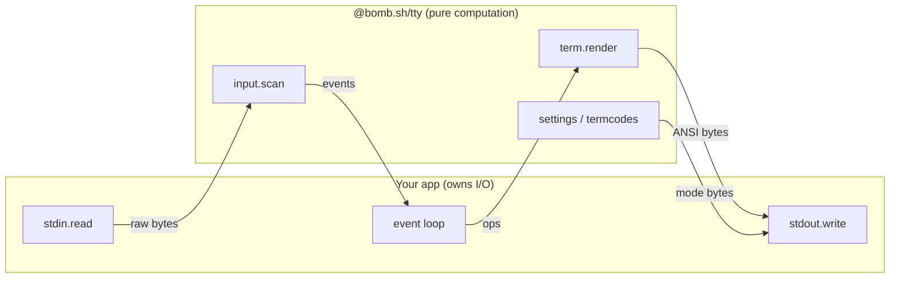
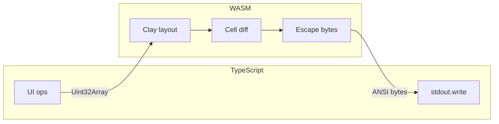
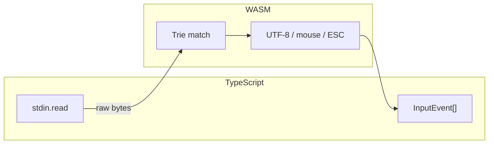

import { Tabs, TabItem, Aside } from '@astrojs/starlight/components';

`@bomb.sh/tty` is a low-level, platform-independent terminal renderer and event parser for JavaScript. Use it directly to build full-screen or inline terminal UIs, or as the foundation for your own framework.

<Aside title="Why “tty”?">
	TTY is short for <strong>teletypewriter</strong>, the electromechanical
	typewriters that served as the first terminals on Unix systems. The hardware
	is long gone, but the name stuck: Unix still calls terminal devices TTYs
	(`/dev/tty`), and the term now refers to any text terminal, which is exactly
	what this package renders to.
</Aside>

## Features

- **Declarative terminal UI:** Flexbox-like layout powered by [Clay](https://github.com/nicbarker/clay), with borders, colors, floating elements, scroll containers, and pointer hit-testing
- **Zero I/O:** Never reads stdin or writes stdout. Feed bytes in, get bytes and events back
- **Runs everywhere:** The entire engine is compiled to WebAssembly with no native dependencies for consumers

## When to use it

Reach for `@bomb.sh/tty` when you need a **rendering engine** for terminal UI: layout, styling, diffing, and input parsing, without committing to a particular app framework or I/O model.

### Good fits

- **Full-screen applications:** Dashboards, tools, and games that take over the alternate screen buffer with layouts, borders, mouse hover, and keyboard input (see the [2048](/docs/tty/guides/examples) and [keyboard](/docs/tty/guides/examples) demos)
- **Inline animated output:** Spinners, progress bars, or live status regions embedded in normal scrollback without switching to a full-screen mode (see [inline regions](/docs/tty/guides/examples))
- **Rich, structured output:** Diff views, panels, sidebars, and multi-pane layouts where hand-written ANSI becomes unmaintainable
- **Interactive layouts with pointer support:** Hover states, clickable regions, and drag-style interactions driven by terminal mouse reporting
- **Animated UI:** Transitions on width, color, position, and other properties with efficient cell-level diffing between frames
- **Custom TUI frameworks:** Zero I/O means you wire stdin/stdout (or any byte stream) yourself; the engine stays a pure compute layer you can embed in Node, Deno, Bun, or the browser

### When to pick something else

- **One-shot CLI prompts** (text input, selects, confirms): use [`@clack/prompts`](/docs/clack/basics/getting-started); it targets a different problem and uses Node's built-in `tty` module, not this package
- **Component-based UI with state and bindings:** use `@clack/ui`, which is built on `@bomb.sh/tty` and handles the higher-level framework concerns for you

## Requirements

Node >= 22. Also works in Deno, Bun, and browsers.

## Installation

<Tabs>
	<TabItem label="npm" icon="seti:npm">
		```bash
		npm install @bomb.sh/tty
		```
	</TabItem>
	<TabItem label="pnpm" icon="pnpm">
		```bash
		pnpm add @bomb.sh/tty
		```
	</TabItem>
	<TabItem label="Yarn" icon="seti:yarn">
		```bash
		yarn add @bomb.sh/tty
		```
	</TabItem>
</Tabs>

## Core concepts

**Frames as snapshots.** Each frame is a complete, independent UI description. Build an array of ops (`open`, `text`, `close`), pass it to `term.render()`, and write the returned ANSI bytes to stdout. The renderer carries layout and diff state between frames, not a persistent component tree.

**Zero I/O boundary.** You own stdin/stdout. `@bomb.sh/tty` is pure computation: one WASM call per frame on the output side, and a byte-stream parser on the input side.

**Efficient output.** Clay runs layout, walks render commands into a cell buffer, and diffs against the previous frame. Only changed cells produce ANSI escape sequences.

## Architecture

The whole design follows from one principle: **zero I/O**. The engine never reads stdin or writes stdout, you feed it bytes and it hands bytes back. Because the WASM module is pure computation with no I/O, it runs anywhere WebAssembly does: Node, Deno, Bun, or the browser, and it can serve as the foundation for higher-level frameworks.

That principle splits the system into two independent data flows: an **output pipeline** that turns your UI description into ANSI bytes, and an **input pipeline** that turns raw terminal bytes into structured events. Your app sits on the outside, owning all I/O:



### Output



Each frame's ops flatten into a single `Uint32Array` sent to WASM in one call. Clay performs layout, walks the render commands into a cell buffer, and diffs it against the previous frame. Only changed cells become ANSI escape sequences, so stdout writes stay small even for busy full-screen UIs.

### Input



Raw bytes are fed into a WASM parser that recognizes VT/ANSI escape sequences, UTF-8 codepoints, and mouse protocols. Partial sequences that arrive across read boundaries are reassembled automatically. A lone ESC byte is held for a configurable latency window (default 25ms) before being emitted.

### Why the API is split this way

Each of the five [API modules](/docs/tty/api/) maps directly onto this architecture:

- **[Ops](/docs/tty/api/ops):** Pure data builders that describe a frame. Calling `open`, `text`, or `close` has no side effects — it only produces the directives the output pipeline consumes
- **[Term](/docs/tty/api/term):** The output pipeline. Ops go in; ANSI bytes and pointer events come out
- **[Input](/docs/tty/api/input):** The input pipeline. Raw bytes go in; structured keyboard and mouse events come out
- **[Settings](/docs/tty/api/settings) and [Termcodes](/docs/tty/api/termcodes):** Because you own stdin/stdout, you also own terminal state. These build the escape bytes to apply and revert modes (alternate buffer, cursor, mouse tracking) yourself

Every module is either pure computation or byte construction — none of them touches I/O. That's what keeps the whole API surface identical across runtimes, and what lets you swap `process.stdout` for any byte sink you like.

## Quick start: rendering

To render this:

```
╭───────────────╮
│ Hello, World! │
╰───────────────╯
```

```ts twoslash
import { close, createTerm, grow, open, rgba, text } from "@bomb.sh/tty";

async function main() {
  let term = await createTerm({ width: 80, height: 24 });

  let { output } = term.render([
    open("root", {
      layout: { width: grow(), height: grow(), direction: "ttb" },
    }),
    open("greeting", {
      layout: { padding: { left: 1, right: 1, top: 1, bottom: 1 } },
      border: {
        color: rgba(0, 255, 0),
        left: 1, right: 1, top: 1, bottom: 1,
      },
      cornerRadius: { tl: 1, tr: 1, bl: 1, br: 1 },
    }),
    text("Hello, World!"),
    close(),
    close(),
  ]);

  process.stdout.write(output);
}
```

## Quick start: input

```ts twoslash
import { createInput } from "@bomb.sh/tty";

async function main() {
  let input = await createInput({ escLatency: 25 });

  process.stdin.setRawMode(true);
  let timer: ReturnType<typeof setTimeout> | undefined;

  process.stdin.on("data", (buf) => {
    clearTimeout(timer);

    let { events, pending } = input.scan(new Uint8Array(buf));

    for (let event of events) {
      console.log(event);
    }

    if (pending) {
      timer = setTimeout(() => {
        let flush = input.scan();
        for (let event of flush.events) {
          console.log(event);
        }
      }, pending.delay);
    }
  });
}
```

## Quick start: terminal modes

Use composable settings to enter alternate buffer mode, hide the cursor, and enable mouse tracking:

```ts twoslash
import {
  alternateBuffer,
  cursor,
  mouseTracking,
  settings,
} from "@bomb.sh/tty";

let tty = settings(alternateBuffer(), cursor(false), mouseTracking());
process.stdout.write(tty.apply);

// on exit:
process.stdout.write(tty.revert);
```

## Demos

The input parser decodes raw terminal bytes into structured events. Here you can see each key event as the string "hello world" is typed:


Hover styles applied to UI elements in response to pointer state. Clay drives hit testing, so you don't need manual coordinate math:


## Next steps

1. Explore [runnable examples](/docs/tty/guides/examples) on GitHub
2. Read the [Ops API](/docs/tty/api/ops) for layout and styling directives
3. Join our [Discord community](https://bomb.sh/chat) for support and discussions
